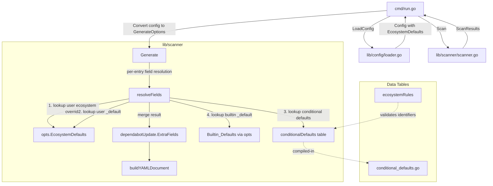

# Design Document: Conditional Ecosystem Defaults

## Overview

This feature introduces a compiled-in data table (`conditionalDefaults`) that injects ecosystem-specific Dependabot configuration fields during YAML generation. The table lives in `lib/scanner/` alongside the existing `ecosystemRules` table and follows the same data-driven pattern: adding a new conditional default requires appending a single struct literal.

The initial payload is `insecure-external-code-execution: "deny"` for bundler, mix, and pip. The mechanism is generic — any dotted-path field key can be conditionally applied to any set of ecosystems.

The feature integrates into the existing `Generate` function's field resolution path as a new priority layer between Builtin_Defaults and user-configured `.depgen.toml` overrides.

## Architecture



The field resolution becomes a four-layer merge where each layer can contribute fields, and higher-priority layers override lower-priority ones for the same dotted-path key.

**Merge precedence (highest to lowest):**

1. User `.depgen.toml` ecosystem-specific override (e.g., `[ecosystems.bundler]`)
2. User `.depgen.toml` `_default` override (e.g., `[ecosystems._default]`)
3. Conditional_Defaults_Table entry matched by ecosystem identifier
4. Builtin_Defaults `_default` (`DefaultEcosystemSettings["_default"]`)

## Components and interfaces

### New file: `lib/scanner/conditional_defaults.go`

Contains the `ConditionalDefault` struct type and the `conditionalDefaults` package-level slice variable.

### Modified file: `lib/scanner/scanner.go`

The `Generate` function's per-entry field resolution loop is extended to insert conditional defaults at the correct priority level. The current logic that does a simple two-level lookup (ecosystem-specific → `_default`) becomes a four-level merge.

### No changes to `lib/config/`

The config package remains unaware of conditional defaults. The merge happens entirely within the scanner's `Generate` function using the already-resolved `EcosystemDefaults` map from config plus the compiled-in conditional defaults table.

## Data models

### ConditionalDefault struct

```go
// ConditionalDefault defines a single field-value pair that is injected into
// generated update entries only when the entry's ecosystem matches one of
// the listed identifiers. This struct is the unit of the compiled-in
// conditional defaults table.
type ConditionalDefault struct {
    // FieldKey is the dotted-path field name matching the format used in
    // EcosystemConfig.Fields (e.g., "insecure-external-code-execution",
    // "schedule.interval").
    FieldKey string

    // FieldValue is the value to inject, consistent with the existing
    // map[string]any pattern used by EcosystemSettings.Fields.
    FieldValue any

    // Ecosystems is the set of ecosystem identifiers (matching
    // EcosystemRule.Identifier values) for which this default applies.
    // Must be non-empty.
    Ecosystems []string
}
```

### conditionalDefaults table

```go
// conditionalDefaults is the compiled-in table of ecosystem-specific field
// defaults. Each entry specifies a field key-value pair and the ecosystems
// where it applies. Adding a new conditional default requires appending a
// single struct literal to this slice.
//
// The table is intentionally not exported — it is consumed only by Generate
// and validated by tests. External code interacts with conditional defaults
// only through the generated YAML output.
var conditionalDefaults = []ConditionalDefault{
    {
        FieldKey:   "insecure-external-code-execution",
        FieldValue: "deny",
        Ecosystems: []string{"bundler", "mix", "pip"},
    },
}
```

### Field resolution algorithm (pseudocode)

```text
function resolveFieldsForEntry(ecosystem, opts.EcosystemDefaults):
    merged = {}

    // Layer 4 (lowest priority): Builtin _default
    if opts.EcosystemDefaults["_default"] exists and has Fields:
        merged = copy(opts.EcosystemDefaults["_default"].Fields)

    // Layer 3: Conditional defaults for this ecosystem
    for each entry in conditionalDefaults:
        if ecosystem in entry.Ecosystems:
            merged[entry.FieldKey] = entry.FieldValue

    // Layer 2: User _default override
    // (already merged into opts.EcosystemDefaults["_default"] by config loader)
    // NOTE: config loader merges user _default INTO the defaults map, so
    // layer 4 already includes user _default overrides. See below for
    // actual implementation approach.

    // Layer 1 (highest priority): User ecosystem-specific override
    if opts.EcosystemDefaults[ecosystem] exists and has Fields:
        for each (key, value) in opts.EcosystemDefaults[ecosystem].Fields:
            merged[key] = value

    return merged
```

**Implementation detail:** The existing config loader (`applyFileConfig`) already merges user `.depgen.toml` entries into the `EcosystemDefaults` map, where ecosystem-specific entries override the `_default`. The `Generate` function currently does a two-level lookup: ecosystem-specific → `_default`. The new implementation inserts conditional defaults between these two levels.

### Actual implementation approach

```go
func resolveFields(
    ecosystem string,
    ecoDefaults map[string]EcosystemSettings,
) map[string]any {
    merged := make(map[string]any)

    // Layer 4 + Layer 2: _default (builtin merged with user _default by loader)
    if defSettings, ok := ecoDefaults[defaultEcosystemKey]; ok {
        if defSettings.Fields != nil {
            for k, v := range defSettings.Fields {
                merged[k] = v
            }
        }
    }

    // Layer 3: Conditional defaults for this ecosystem
    for i := range conditionalDefaults {
        if slices.Contains(conditionalDefaults[i].Ecosystems, ecosystem) {
            merged[conditionalDefaults[i].FieldKey] = conditionalDefaults[i].FieldValue
        }
    }

    // Layer 1: User ecosystem-specific override (highest priority)
    if ecoSettings, ok := ecoDefaults[ecosystem]; ok {
        if ecoSettings.Fields != nil {
            for k, v := range ecoSettings.Fields {
                merged[k] = v
            }
        }
    }

    return merged
}
```

### Validation function

```go
// validateConditionalDefaults checks the compiled-in table for invalid
// entries. It rejects entries that use the reserved "_default" identifier
// and entries with empty ecosystem lists.
func validateConditionalDefaults() error {
    for i, entry := range conditionalDefaults {
        if len(entry.Ecosystems) == 0 {
            return fmt.Errorf(
                "%w: entry %d has empty ecosystems list",
                ErrConditionalDefaultInvalid, i,
            )
        }

        if entry.FieldKey == "" {
            return fmt.Errorf(
                "%w: entry %d has empty field key",
                ErrConditionalDefaultInvalid, i,
            )
        }

        for _, eco := range entry.Ecosystems {
            if eco == defaultEcosystemKey {
                return fmt.Errorf(
                    "%w: entry %d uses reserved key %q",
                    ErrConditionalDefaultInvalid, i, defaultEcosystemKey,
                )
            }
        }
    }

    return nil
}
```

### Integration into generate

The current field resolution in `Generate`:

```go
// Current (before this feature):
if opts != nil && opts.EcosystemDefaults != nil {
    for i := range updates {
        eco := updates[i].PackageEcosystem
        settings, ok := opts.EcosystemDefaults[eco]
        if !ok {
            settings, ok = opts.EcosystemDefaults[defaultEcosystemKey]
        }
        if ok && settings.Fields != nil {
            updates[i].ExtraFields = settings.Fields
        }
    }
}
```

Becomes:

```go
// New (with conditional defaults):
for i := range updates {
    eco := updates[i].PackageEcosystem
    updates[i].ExtraFields = resolveFields(eco, opts.EcosystemDefaults)
}
```

The `resolveFields` helper encapsulates the four-layer merge, keeping `Generate` focused on orchestration.

## Correctness properties

_A property is a characteristic or behavior that should hold true across all valid executions of a system — essentially, a formal statement about what the system should do. Properties serve as the bridge between human-readable specifications and machine-verifiable correctness guarantees._

### Property 1: Merge precedence

_For any_ field key that is defined at multiple priority layers (user ecosystem override, user `_default`, conditional defaults, builtin `_default`), the resolved value in the merged result SHALL equal the value from the highest-priority layer that defines it.

**Validates: Requirements 2.3, 2.4, 3.1, 3.2, 3.6, 6.3.**

### Property 2: Conditional application

_For any_ scan result whose ecosystem identifier appears in the Ecosystems list of a `ConditionalDefault` entry, the generated YAML output for that update entry SHALL contain the conditional field key-value pair (unless overridden by a higher-priority layer).

**Validates: Requirements 2.1, 5.2, 5.3.**

### Property 3: Non-interference for non-matching ecosystems

_For any_ set of scan results containing only ecosystem identifiers that do NOT appear in any `ConditionalDefault` entry's Ecosystems list, the generated YAML output SHALL be byte-for-byte identical to the output produced by the same inputs without the conditional defaults mechanism.

**Validates: Requirements 2.2, 4.1, 4.2, 4.3.**

### Property 4: Field preservation from lower-priority sources

_For any_ field key from a lower-priority source whose dotted-path key does NOT appear in any higher-priority source (including conditional defaults), that field SHALL appear in the merged result with its original value unchanged. An empty or nil Fields map at a higher-priority layer SHALL NOT suppress fields from lower layers.

**Validates: Requirements 3.3, 3.4.**

### Property 5: Empty table identity

_For any_ set of scan results and configuration, when the `conditionalDefaults` slice contains zero entries, the generated YAML output SHALL be identical to the output produced by the pre-feature Generate function (builtin defaults merged with user overrides only).

**Validates: Requirements 2.5.**

### Property 6: Output determinism

_For any_ set of scan results and configuration (including conditional defaults), calling `Generate` multiple times with identical inputs SHALL produce byte-for-byte identical output on every invocation.

**Validates: Requirements 6.1.**

### Property 7: Alphabetical field ordering

_For any_ update entry in the generated YAML that contains multiple extra fields (from any combination of conditional defaults, builtin defaults, and user overrides), the top-level keys of those extra fields SHALL appear in strict alphabetical order after the `directory` field.

**Validates: Requirements 2.6, 6.2.**

## Error handling

| Condition                                                         | Detection point                                            | Error type                     | User message                                                 |
|-------------------------------------------------------------------|------------------------------------------------------------|--------------------------------|--------------------------------------------------------------|
| Conditional default entry uses `_default` as ecosystem identifier | `validateConditionalDefaults()` called during init or test | `ErrConditionalDefaultInvalid` | "conditional default entry N uses reserved key \"_default\"" |
| Conditional default entry has empty Ecosystems slice              | `validateConditionalDefaults()`                            | `ErrConditionalDefaultInvalid` | "conditional default entry N has empty ecosystems list"      |
| Conditional default entry has empty FieldKey                      | `validateConditionalDefaults()`                            | `ErrConditionalDefaultInvalid` | "conditional default entry N has empty field key"            |

Because the table is compiled-in and immutable, validation errors indicate a programming mistake rather than user misconfiguration. The validation function is called from tests (not at runtime startup) to keep binary startup cost at zero. If a future change introduces invalid entries, the test suite catches it immediately.

A new sentinel error is defined:

```go
var ErrConditionalDefaultInvalid = errors.New(
    "invalid conditional default entry",
)
```

## Testing strategy

**Dual testing approach:**

* **Unit tests** (example-based): Verify specific scenarios — the initial `insecure-external-code-execution` entry works for bundler/mix/pip, non-matching ecosystems are unaffected, `.depgen.toml` overrides win, validation rejects `_default`.
* **Property tests** (property-based with `pgregory.net/rapid`): Verify the seven correctness properties above across randomized inputs — random ecosystem names, random field keys/values, random priority layer combinations.

**Property-based testing configuration:**

* Library: `pgregory.net/rapid` (already used in this project)
* Minimum 100 iterations per property test
* Each property test is tagged with a comment referencing its design property
* Tag format: **Feature: conditional-ecosystem-defaults, Property {number}: {property_text}**

**Test file location:** `lib/scanner/conditional_defaults_test.go`

**Generator strategy for property tests:**

* Ecosystem identifiers: random strings from a mix of valid identifiers (from `ecosystemRules`) and invented ones
* Field keys: random dotted-path strings (e.g., `"a.b"`, `"x"`, `"foo.bar.baz"`)
* Field values: random strings, ints, bools
* Priority layer configurations: randomly populated `EcosystemDefaults` maps with various combinations of `_default` and ecosystem-specific entries
* Conditional defaults table: randomly generated slices of `ConditionalDefault` entries with varying ecosystem sets

**Unit test scenarios:**

* Table validation passes for the production table
* Table validation rejects `_default` ecosystem identifier
* Table validation rejects empty ecosystems list
* Table validation rejects empty field key
* Bundler gets `insecure-external-code-execution: deny`
* Mix gets `insecure-external-code-execution: deny`
* Pip gets `insecure-external-code-execution: deny`
* Gomod does NOT get `insecure-external-code-execution`
* User `.depgen.toml` override for bundler wins over conditional default
* Empty conditional table produces unchanged output
* Dead ecosystem identifiers in table have no effect
